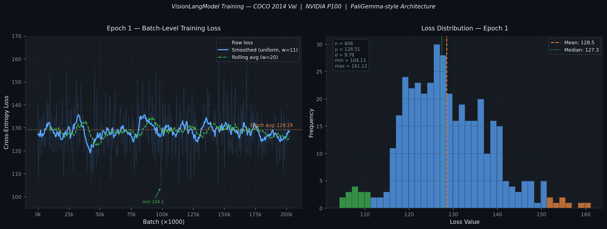

<div align="center">

# VisionLangModel

### A PaliGemma-inspired multimodal vision–language model built from scratch in PyTorch

[](https://python.org)
[](https://pytorch.org)
[](LICENSE)
[](https://www.kaggle.com/code/atandrabharati/visionlangmodel)
[](https://www.kaggle.com/code/atandrabharati/visionlangmodel)

<br/>

*No pre-trained weights. No high-level wrappers. Every component — vision encoder, language decoder, and multimodal projector — built from first principles.*

</div>

---

## Overview

This project implements a **PaliGemma-style vision–language model** completely from scratch using PyTorch. The model learns to generate natural language descriptions of images by jointly training a SigLIP-inspired vision encoder and a Gemma-inspired language decoder, connected by a learned linear projection.

Trained on the **COCO 2014 validation set** (~40k image–caption pairs) on a single NVIDIA Tesla P100.

**Core contributions:**
- Custom SigLIP Vision Encoder with sinusoidal patch position embeddings
- Grouped Query Attention (GQA) language decoder with RoPE and RMSNorm
- GeGLU feed-forward networks in the language decoder
- Linear multimodal projector bridging the two modalities
- P100-specific optimisations: gradient checkpointing + `bfloat16` mixed precision

---

## Training Results

<div align="center">
  
</div>

<br/>

| Metric | Value |
|:-------|:-----:|
| Epoch 1 average loss | **129.19** |
| Loss range (epoch 1) | 104.1 – 161.1 |
| Loss std deviation | ~10.5 |
| Batches per epoch | ~202,500 |
| Effective batch size | 16 (accumulation steps) |
| Hardware | NVIDIA Tesla P100 (16 GB) |

> The high absolute loss is expected for a randomly-initialised model learning to jointly align 196 image patches with free-form COCO captions from scratch, without any pre-training.
> The rolling average shows a clear downward trend across the epoch as the model acquires coarse image–text alignment.

---

## Architecture

```
Input Image (224×224×3)
         │
┌────────▼────────────────────────────────────────────────────────┐
│                  SigLIP Vision Encoder                          │
│                                                                 │
│  Conv2D Patch Embedding (16×16 patches → 196 tokens)           │
│       + Sinusoidal Position Embeddings                          │
│                         │                                       │
│    ┌────────────────────▼──────────────────────┐               │
│    │          VisionEncoderLayer  ×8            │               │
│    │  Pre-Norm LayerNorm                        │               │
│    │  Multi-Head Self-Attention  (8 heads)      │               │
│    │  + Residual                                │               │
│    │  Pre-Norm LayerNorm                        │               │
│    │  MLP: Linear → GELU → Linear              │               │
│    │  + Residual                                │               │
│    └────────────────────────────────────────────┘               │
│                         │                                       │
│                  Final LayerNorm                                │
│              Output: (B, 196, 512)                              │
└─────────────────────────┬───────────────────────────────────────┘
                          │
              ┌───────────▼───────────┐
              │  Multimodal Projector │
              │  Linear 512 → 1024   │
              │  Dropout 0.1         │
              └───────────┬───────────┘
                          │
         [BOS] [IMG]×196 <caption tokens> [EOS]
                          │
┌─────────────────────────▼───────────────────────────────────────┐
│                  Gemma Language Decoder                         │
│                                                                 │
│  Token Embeddings (vocab=32k, d_model=1024)                     │
│  + Image patch embeddings injected at [IMG] positions           │
│                         │                                       │
│    ┌────────────────────▼──────────────────────┐               │
│    │         GemmaDecoderLayer  ×12            │               │
│    │  Pre-Norm RMSNorm                          │               │
│    │  Grouped Query Attention                   │               │
│    │    Q heads: 8   KV heads: 4  head_dim: 128 │               │
│    │    RoPE positional encoding                │               │
│    │    Causal mask                             │               │
│    │  + Residual                                │               │
│    │  Pre-Norm RMSNorm                          │               │
│    │  GeGLU FFN: gate_proj + up_proj → GELU     │               │
│    │  + Residual                                │               │
│    └────────────────────────────────────────────┘               │
│                         │                                       │
│               Final RMSNorm → LM Head                          │
│              Output: next-token logits                          │
└─────────────────────────────────────────────────────────────────┘
```

### Model Configuration

**Vision Encoder**

| Hyperparameter | Value | Note |
|:---------------|:-----:|:-----|
| `image_size` | 224 | Input resolution |
| `patch_size` | 16 | 14×14 = 196 patches |
| `hidden_size` | 512 | Encoder hidden dim |
| `num_hidden_layers` | 8 | Transformer depth |
| `num_attention_heads` | 8 | Vision attention heads |
| `intermediate_size` | 1536 | FFN width |

**Language Decoder**

| Hyperparameter | Value | Note |
|:---------------|:-----:|:-----|
| `hidden_size` | 1024 | Decoder hidden dim |
| `num_hidden_layers` | 12 | Decoder depth |
| `num_attention_heads` | 8 | Query heads (GQA) |
| `num_key_value_heads` | 4 | KV heads (GQA) |
| `head_dim` | 128 | Per-head dimension |
| `intermediate_size` | 2048 | GeGLU inner dim |
| `max_position_embeddings` | 512 | Context window |
| `vocab_size` | 32,000 | Gemma tokenizer |

---

## Repository Structure

```
VisionLangModel/
│
├── src/
│   ├── visionEncoder.py       # SigLIP-style Vision Transformer
│   │                            PatchEmbedding, VisionAttention, VisionMLP,
│   │                            VisionEncoderLayer, SigLIPVisionEncoder
│   │
│   ├── languageDecoder.py     # Gemma-style Language Model
│   │                            RMSNorm, RotaryEmbedding, GroupedQueryAttention,
│   │                            GeGLU, GemmaDecoderLayer, GemmaLanguageModel
│   │
│   ├── multimodalFusion.py    # Multimodal integration + generation
│   │                            MultimodalProjector, PaliGemmaModel,
│   │                            create_optimized_paligemma, optimize_for_p100
│   │
│   └── train.py               # Training loop + CLI entrypoint
│                                COCO download, MultimodalDataset, collate_fn,
│                                gradient accumulation, mixed precision
│
├── assets/
│   └── loss_curve.png         # Training loss visualisation
│
├── results/
│   └── training_log.md        # Full Kaggle P100 training log & notes
│
├── .github/
│   └── workflows/
│       └── ci.yml             # Lint, import checks, forward-pass smoke test
│
├── requirements.txt
├── .gitignore
└── README.md
```

---

## Quickstart

### Prerequisites

```bash
git clone https://github.com/atandra2000/VisionLangModel.git
cd VisionLangModel
pip install -r requirements.txt
```

> A CUDA-capable GPU is strongly recommended. On CPU only the forward pass is feasible, not full training.

### Train

The script automatically downloads COCO 2014 validation images and annotations on first run (~7 GB).

```bash
python src/train.py
```

Override defaults:

```bash
python src/train.py --epochs 5 --lr 3e-4 --accum-steps 8
```

| Flag | Default | Description |
|------|---------|-------------|
| `--epochs` | `20` | Training epochs |
| `--lr` | `1e-4` | AdamW learning rate |
| `--accum-steps` | `16` | Gradient accumulation steps |

---

## Implementation Highlights

### Grouped Query Attention (GQA)
Reduces KV-cache memory during inference by sharing key/value heads across groups of query heads. With 8 query heads and 4 KV heads, the KV cache is half the size of standard multi-head attention.

```python
# Expand KV to match Q head count before dot-product
key_states = key_states.repeat_interleave(self.num_kv_groups, dim=1)
value_states = value_states.repeat_interleave(self.num_kv_groups, dim=1)
```

### Rotary Position Embedding (RoPE)
Applied to query and key tensors via complex-number rotation. Unlike learned absolute positional embeddings, RoPE generalises to sequence lengths beyond those seen at training time.

```python
def apply_rotary_pos_emb(q, k, cos, sin):
    def rotate_half(x):
        x1, x2 = x[..., :x.shape[-1]//2], x[..., x.shape[-1]//2:]
        return torch.cat((-x2, x1), dim=-1)
    return (q * cos) + (rotate_half(q) * sin), (k * cos) + (rotate_half(k) * sin)
```

### GeGLU Feed-Forward Network
Replaces the standard ReLU FFN with a gated variant. The gate pathway learns when to suppress or amplify features, giving the network richer non-linear capacity at minimal parameter overhead.

```python
def forward(self, x):
    return self.down_proj(F.gelu(self.gate_proj(x)) * self.up_proj(x))
```

### Multimodal Input Fusion
Image patch embeddings (after projection) replace the [IMG] placeholder tokens in the text sequence, enabling a unified causal attention over both modalities.

```python
for b in range(batch_size):
    positions = torch.where(input_ids[b] == self.image_token_id)[0]
    start = positions[0].item()
    combined[b, start : start + num_patches] = image_features[b]
```

### Gradient Checkpointing for P100
Recomputes activations during the backward pass rather than storing them, cutting peak VRAM usage at the cost of ~30% extra compute — essential for fitting this model on 16 GB VRAM.

```python
def _checkpointed_forward(module):
    original = module.forward
    def forward(*args, **kwargs):
        return torch.utils.checkpoint.checkpoint(original, *args, use_reentrant=True, **kwargs)
    return forward
```

---

## Tech Stack

| Component | Technology |
|-----------|-----------|
| Deep learning | PyTorch 2.0 |
| Tokenizer | Gemma-2B (via 🤗 Transformers) |
| Dataset | COCO 2014 Validation (~40k pairs) |
| Training hardware | NVIDIA Tesla P100 (16 GB) |
| Platform | Kaggle Notebooks |
| Language | Python 3.11 |

---

## License

Released under the [Apache 2.0 License](LICENSE).

---

<div align="center">

**Atandra Bharati**

[](https://www.kaggle.com/atandrabharati)
[](https://github.com/atandra2000)

</div>
